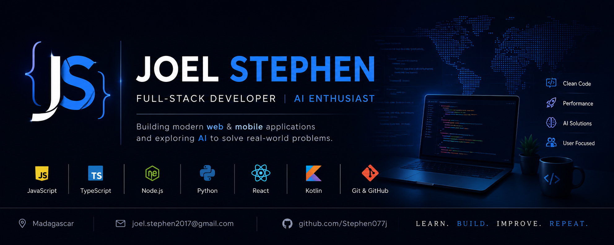

# Hi, I'm Joel Stephen 👋

### AI & Full-Stack Engineer — I build RAG systems, AI SaaS products & developer tools

Master's in **Mathematics** + **Artificial Intelligence** (ENI Fianarantsoa, Madagascar 🇲🇬).
I architect complete systems end-to-end: **FastAPI/LLM** backends, **React & Next.js** frontends,
and **data pipelines** — turning data and AI into products that solve real problems.

---

## 🚀 Featured work

| Project | What it is | Stack |
|---|---|---|
| 🎓 **University Reference** 🔒 | Online learning (LMS) + campus ERP platform | TanStack · Express · Prisma · PostgreSQL · Socket.io |
| 📊 **DataPulse** 🔒 | End-to-end streaming data & ML platform | Kafka · Spark · Flink · Airflow · dbt |
| ⚖️ **LegalMind** 🔒 | Multi-agent RAG assistant over Malagasy law | FastAPI · LangChain · Claude · Qdrant |
| 🛍️ **ListingForge AI** 🔒 | AI SaaS: SEO listings → Shopify / Etsy / Amazon | FastAPI · Claude · React · Celery |
| 🔨 **CodeForge** 🔒 | Code-generation LLM trained from scratch | PyTorch · Transformers |
| 🛎️ [**ARENAH**](https://github.com/Stephen077j/site-arena_multiplatform) | Self-service SaaS bundling 10 service modules | React · Supabase · TypeScript |
| 🤖 [**AI Creator Platform**](https://github.com/Stephen077j/platform-forgeux) | Create & share AI agents and prompts | FastAPI · Next.js · PWA |

🔒 = private repository — available on request.

---

## 🛠️ Tech

**Languages:** Python · TypeScript / JavaScript · Node.js · SQL
**AI / ML:** RAG · LLMs (Claude) · LangChain · NLP (CamemBERT) · PyTorch
**Frontend:** React · Next.js · React Native (Expo) · TailwindCSS
**Backend:** FastAPI · Express · REST · WebSocket · JWT
**Data:** PostgreSQL · MongoDB · Supabase · Qdrant · Redis · Kafka · Spark · Airflow · dbt
**DevOps:** Docker · Kubernetes · CI/CD (GitHub Actions) · Celery · Prometheus

---

## 📈 GitHub

---

## 📫 Reach me

