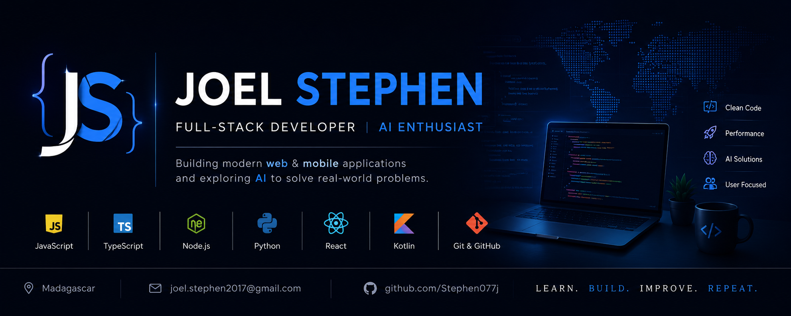

### Building useful software, from Madagascar to the world 🌍

**Full-Stack Development · AI Engineering · Business Applications**

[**About**](#hi-im-joel-stephen-) · [**Solutions**](#atsic--solutions-pour-vos-besoins--solutions-for-your-business) · [**Featured work**](#featured-work) · [**Tech**](#tech) · [**Contact**](#reach-me)

---

# Hi, I'm Joel Stephen 👋

### AI & Full-Stack Engineer — I build RAG systems, AI SaaS products & developer tools

Master's in **Mathematics** + **Artificial Intelligence** (ENI Fianarantsoa, Madagascar 🇲🇬).
I architect complete systems end-to-end: **FastAPI/LLM** backends, **React & Next.js** frontends,
and **data pipelines** — turning data and AI into products that solve real problems.

> Most project repositories are **private to protect the source code**. Descriptions and demos are
> shared below and on my portfolio — **code and live walkthroughs available on request.**

---

## What I build

I design and develop practical applications for organizations — from requirements and interfaces to APIs, data models and testing.

| Product area | Examples of my work | Focus |
|:--|:--|:--|
| **Business software** | ARENAH and point-of-sale systems | Sales, operations and multi-service workflows |
| **Education platforms** | EDUVERSE | Administration, learning and student services |
| **Productivity & mobile** | AVANA | Personal organization and mobile workflows |
| **AI & developer tools** | NLP, RAG and automation experiments | Applied AI and engineering tooling |

**Looking for a technical partner?** I can discuss a scope, prepare a demonstration using non-sensitive data, and explain the implementation choices. Most commercial source repositories are private.

[Explore my public repositories](https://github.com/Stephen077j?tab=repositories&q=&type=public) · [View my contribution activity](https://github.com/Stephen077j?tab=overview)

---

## ATSIC — Solutions pour vos besoins / Solutions for your business

### Français

Je développe des outils web et mobiles et des bases réutilisables pour organiser les opérations : stock, devis, rendez-vous, interventions et inventaire. Mon travail avec ATSIC relie l’analyse du besoin, le développement logiciel et les vérifications techniques.

| Besoin client | Exemple à présenter | Technologies |
|---|---|---|
| Boutique ou atelier | Stock, mouvements, export et import CSV avec aperçu | Node.js · SQLite |
| Consultant ou prestataire | Devis, remise avant taxe, impression et fichiers JSON | React · TypeScript |
| Salon ou équipe de services | Agenda par collaborateur et contrôle des conflits | Vue · JavaScript |

**Ma méthode :** comprendre le besoin, montrer un exemple avec des données fictives, adapter les règles puis vérifier les parcours. Ces exemples sont des bases locales à personnaliser ; les dépôts sources sont privés. Démonstration accompagnée disponible sur demande.

### English

I develop web and mobile tools and reusable business components for inventory, quotations, appointments and service operations. Through ATSIC, I connect requirements analysis, implementation and technical verification.

**Selected examples:** inventory with CSV preview/import; quotations with discounts, tax and JSON backup; staff appointments with conflict detection. These are local starter projects to adapt to each client. Source repositories remain private; guided demonstrations are available on request.

**Working approach:** understand your workflow, demonstrate with sample data, customize the rules and verify the result. Shared deployments need appropriate access control, backups and hosting.

**Contact / Get in touch:** use the LinkedIn or email links below. Describe your activity, current workflow and the problem you want to solve.

---

## Featured work

> Selected work spans commercial applications, university software and AI experiments. Private source code is not publicly downloadable; request a demonstration or technical walkthrough when available.

| Project | What it is | Stack |
|---|---|---|
|  **University Reference** | Online learning (LMS) + campus ERP platform | TanStack · Express · Prisma · PostgreSQL · Socket.io |
|  **DataPulse** | End-to-end streaming data & ML platform | Kafka · Spark · Flink · Airflow · dbt |
|  **LegalMind** | Multi-agent RAG assistant over Malagasy law | FastAPI · LangChain · Claude · Qdrant |
|  **ListingForge AI** | AI SaaS: SEO listings → Shopify / Etsy / Amazon | FastAPI · Claude · React · Celery |
|  **CodeForge** | Code-generation LLM trained from scratch | PyTorch · Transformers |
|  **ARENAH** | Self-service SaaS bundling 10 service modules | React · Supabase · TypeScript |
|  **AI Creator Platform** | Create & share AI agents and prompts | FastAPI · Next.js · PWA |

*Private repositories — I'm happy to walk through the code and give access on request.*

---

## Tech

**Languages:** Python · TypeScript / JavaScript · Node.js · SQL
**AI / ML:** RAG · LLMs (Claude) · LangChain · NLP (CamemBERT) · PyTorch
**Frontend:** React · Next.js · React Native (Expo) · TailwindCSS
**Backend:** FastAPI · Express · REST · WebSocket · JWT
**Data:** PostgreSQL · MongoDB · Supabase · Qdrant · Redis · Kafka · Spark · Airflow · dbt
**DevOps:** Docker · Kubernetes · CI/CD (GitHub Actions) · Celery · Prometheus

---

## GitHub

> Contribution counts and activity are shown by GitHub directly on this profile. Private repositories remain private.

---

## Reach me

